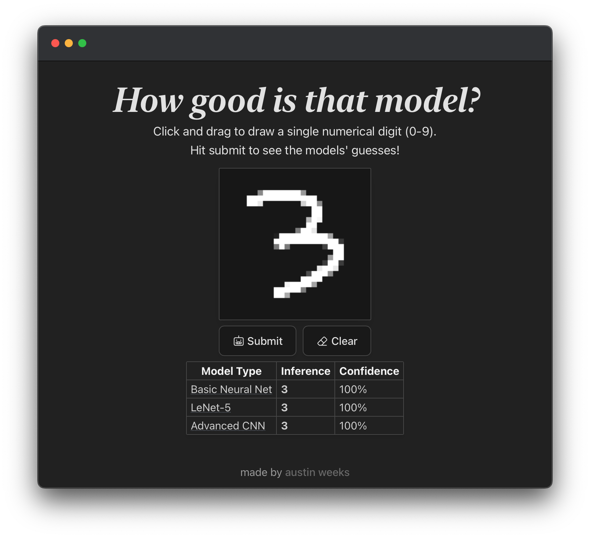

# 🤖 Machine-Learning Interactive Site

A machine-learning project with three parts...
- [The Frontend](/frontend/) - *the main show* - users can draw digits and view model predictions
- [The Models](/models/) - the various PyTorch models and pipelines for their training
- [The Server](/server/) - a simple Flask API that receives drawing, and serves model inferences

[Try it out for yourself!](https://austin-weeks.github.io/ml-interactive-site)
